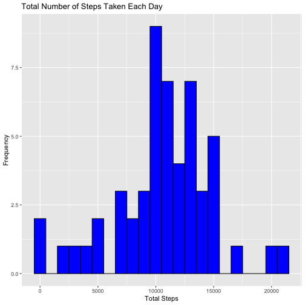
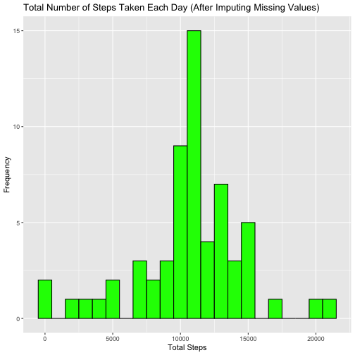

### Loading and Preprocessing the Data


``` r
# Load the necessary libraries
library(ggplot2)
library(dplyr)

# Read the dataset
data <- read.csv("activity.csv")

# Convert the date column to Date type
data$date <- as.Date(data$date, format="%Y-%m-%d")

# Display the first few rows of the dataset
head(data)
```

## Mean Total Number of Steps Taken Per Day

### Calculate the total number of steps taken per day


``` r
total_steps_per_day <- data %>% 
  filter(!is.na(steps)) %>% 
  group_by(date) %>% 
  summarize(total_steps = sum(steps))

# Display the first few rows of total steps per day
head(total_steps_per_day)
```

### Make a histogram of the total number of steps taken each day


``` r
ggplot(total_steps_per_day, aes(x=total_steps)) + 
  geom_histogram(binwidth=1000, fill="blue", color="black") + 
  labs(title="Total Number of Steps Taken Each Day", x="Total Steps", y="Frequency")
```



### Calculate and report the mean and median of the total number of steps taken per day


``` r
mean_steps <- mean(total_steps_per_day$total_steps)
median_steps <- median(total_steps_per_day$total_steps)

mean_steps
```

```
## [1] 10766.19
```

``` r
median_steps
```

```
## [1] 10765
```

## Average Daily Activity Pattern

### Make a time series plot of the 5-minute interval and the average number of steps taken


``` r
average_steps_per_interval <- data %>% 
  filter(!is.na(steps)) %>% 
  group_by(interval) %>% 
  summarize(average_steps = mean(steps))

ggplot(average_steps_per_interval, aes(x=interval, y=average_steps)) + 
  geom_line(color="blue") + 
  labs(title="Average Daily Activity Pattern", x="5-minute Interval", y="Average Number of Steps")
```


### Which 5-minute interval, on average, contains the maximum number of steps?


``` r
max_interval <- average_steps_per_interval %>% 
  filter(average_steps == max(average_steps))

max_interval
```

## Imputing Missing Values

### Calculate and report the total number of missing values in the dataset


``` r
total_na <- sum(is.na(data$steps))
total_na
```

```
## [1] 2304
```

### Devise a strategy for filling in all of the missing values


``` r
# Use the mean for that 5-minute interval to fill in missing values
filled_data <- data
filled_data$steps[is.na(filled_data$steps)] <- average_steps_per_interval$average_steps[match(filled_data$interval[is.na(filled_data$steps)], average_steps_per_interval$interval)]

# Verify there are no more missing values
sum(is.na(filled_data$steps))
```

```
## [1] 0
```

### Make a histogram of the total number of steps taken each day after missing values are imputed


``` r
total_steps_per_day_filled <- filled_data %>% 
  group_by(date) %>% 
  summarize(total_steps = sum(steps))

ggplot(total_steps_per_day_filled, aes(x=total_steps)) + 
  geom_histogram(binwidth=1000, fill="green", color="black") + 
  labs(title="Total Number of Steps Taken Each Day (After Imputing Missing Values)", x="Total Steps", y="Frequency")
```



``` r
# Calculate and report the mean and median
mean_steps_filled <- mean(total_steps_per_day_filled$total_steps)
median_steps_filled <- median(total_steps_per_day_filled$total_steps)

mean_steps_filled
```

```
## [1] 10766.19
```

``` r
median_steps_filled
```

```
## [1] 10766.19
```

## Differences in Activity Patterns Between Weekdays and Weekends

### Create a new factor variable in the dataset indicating whether a given date is a weekday or weekend


``` r
filled_data$day_type <- ifelse(weekdays(filled_data$date) %in% c("Saturday", "Sunday"), "weekend", "weekday")

# Convert to factor
filled_data$day_type <- factor(filled_data$day_type, levels = c("weekday", "weekend"))

# Verify the new variable
head(filled_data)
```

### Make a panel plot comparing the average number of steps taken per 5-minute interval across weekdays and weekends


``` r
average_steps_per_interval_day_type <- filled_data %>% 
  group_by(interval, day_type) %>% 
  summarize(average_steps = mean(steps))
```

```
## `summarise()` has grouped output by 'interval'. You can override using the `.groups` argument.
```

``` r
ggplot(average_steps_per_interval_day_type, aes(x=interval, y=average_steps, color=day_type)) + 
  geom_line() + 
  facet_wrap(~day_type, ncol=1) + 
  labs(title="Average Number of Steps per 5-minute Interval (Weekday vs Weekend)", x="5-minute Interval", y="Average Number of Steps")
```


